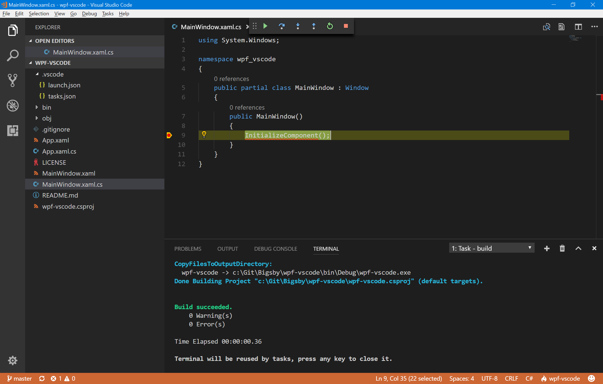

# Running and debugging a WPF project in Visual Studio Code

The *special* things to take into account to run and debug a **WPF** project in **Visual Studio Code** are:

- ## In **.csproj*:
  - Target Platform needs to be x64: *<PlatformTarget>x64</PlatformTarget>*;
  - PDB needs to be portable: *<DebugType>portable</DebugType>*
  - Set generator on **.xaml* files: *<Generator>MSBuild:Compile</Generator>*

- ## In *.vscode/tasks.json*:
  - *command* needs to point to *msbuild.exe*: *"command": "C:\\Program Files (x86)\\Microsoft Visual Studio\\2017\\Professional\\MSBuild\\15.0\\Bin\\MSBuild.exe"*
  > This is setup for **Visual Studio 2017 Professional** tools. Ajust if a different version is used.

- ## In *.vscode/launch.json*:
  - Launch *type* is *clr*: *"type": "clr"*
  - *program* point to build resultin *.exe*: *"program": "${workspaceRoot}/bin/Debug/wpf-vscode.exe"*

To test, just open this folder in **Visual Studio Code** and hit *F5*.

